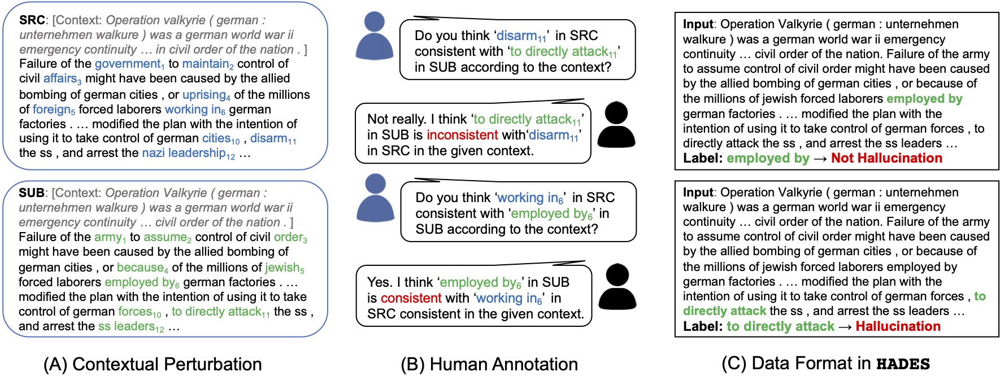
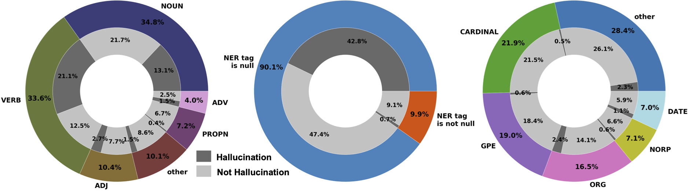

# HAllucination DEtection dataSet (HADES)

A novel token-level reference-free [hallucination detection dataset](https://arxiv.org/pdf/2104.08704) for free-form text generation. The code implementation is based on [huggingface transformers](https://github.com/huggingface/transformers).

If you find the data or code in this repo useful, please consider citing the following paper:

```
@article{liu2021token,
  title={A Token-level Reference-free Hallucination Detection Benchmark for Free-form Text Generation},
  author={Liu, Tianyu and Zhang, Yizhe and Brockett, Chris and Mao, Yi and Sui, Zhifang and Chen, Weizhu and Dolan, Bill},
  journal={arXiv preprint arXiv:2104.08704},
  year={2021}
}
```

## Dataset Overview

### Download

The dataset can be downloaded [here](https://drive.google.com/file/d/1dM8gWCwh0UABV5I42xLNeFuxGK8zOuVB/view?usp=sharinghttps://drive.google.com/file/d/1dM8gWCwh0UABV5I42xLNeFuxGK8zOuVB/view?usp=sharing). Please unzip the downloaded "Wiki-Hades.zip" inside the "data_collections" folder.


### Format

Given an input sentence and target words (spans), decide if the target is hallucinated in the given context, which is actually a binary classification task.

> Input: ... She had a large family and live with her grandparents ... In 1933 she gave birth to her first child ... In July of 1926, many of her friends attended her **funeral** ... 
> 
> Label: **funeral** -> Hallucination

The actual data will be provide in the json format, for the instance above, we have:
> {"replaced": "... She had a large family and live with her grandparents ... In 1933 she gave birth to her first child ... In July of 1926, many of her friends attended her ===funeral=== ...", "replaced_ids": [69, 69], "hallucination": 1} 

### Test Mode

To simulate real-world NLG applications, we propose two sub-tasks with “offline” and “online” settings. In the **offline** setting, it is assumed that generation is complete, so the the model is able perceive the bidirectional context. This could be used in the post-generation examination of NLG systems. For **online** detection, the model can only access the unidirectional preceding context, which simulates on-the-fly generation. 

### Data Collection



To collect the HADES dataset, we first perturb “raw text” web data ([WIKI-40B](https://www.aclweb.org/anthology/2020.lrec-1.297/)) into “perturbed text” with out-of-box BERT model. We then ask human annotators to assess whether the perturbed text spans are hallucinations given the original text. We apply effective techniques in the contextual perturbation phase and multi-round human annotation, please refer to the paper for more details.

### Data Statistics

We show the ratio of “hallucination”(H)/ “not hallucination” (N ) cases for different Part-of-Speech (POS) and Name Entity Recognition (NER) tags below:



We split the dataset into train, validation and test sets with sizes of 8754, 1000, 1200 respectively. “hallucination” cases slightly outnumber “not hallucination” cases, with a ratio of 54.5%/45.5%.

## Baselines

### Environment

To replicate the baseline detection models reported in the paper. We provide the Anaconda environment script. To start the environment, please run

```
conda env create -f hades.yaml
conda activate hades
pip install -r requirements.txt
```

### Training

Please run the ```pretrain_clf.py``` and ```feature_clf.py``` in the ```\baselines``` fold with the following instructions.

For pretrained models using BERT-large in the online test mode:
```
python pretrain_clf.py --lr 1e-3 --dropout 0 --task_mode online --load_model bert-large-uncased 
```
Likewise, the ```task_mode``` can be ```offline```, and the ```load_model``` can be ```roberta-large```, ```xlnet-large-cased``` and ```gpt2-medium```, which corresponds to the pretrained model baselines in the paper.


For feature-based models (can only be used in the offline test mode):
```
python feature_clf.py --mode svm
```
```mode``` can be ```svm``` (support vector machine) or ```lr``` (logistic regression). The features we use include word probability, TF-IDF, PPMI and word entrophy.

### Evaluation

To evaluate the hallucination detector, taking ```bert-large-uncased``` in the ```offline``` setting as an example

```
python pretrain_clf.py --task_mode offline --load_model bert-large-uncased --inf_model path_to_model/best_model.pt --inf_data ../data_collections/Wiki-Hades/valid.txt
```

We provide the related detecting model (```bert-large-uncased```, ```offline``` ) [here](https://drive.google.com/file/d/1bhTV6fndQo-ZYnMODwPcDjPOmxsIDSQC/view?usp=sharing). If running correctly, the system should output results (note that the following numbers are model performance on the valid set) as in below:

```
Acc : 0.709
f1 : 0.7408726625111309 0.6681870011402509
precision : 0.6819672131147541 0.7512820512820513
recall : 0.8109161793372319 0.6016427104722792
G-mean : 0.6984853671214227
bss : 0.18964858912275
ROC-AUC : 0.778624350060641
```


## Citation

If you find the data or code in this repo useful, please consider citing the following paper:

```
@article{liu2021token,
  title={A Token-level Reference-free Hallucination Detection Benchmark for Free-form Text Generation},
  author={Liu, Tianyu and Zhang, Yizhe and Brockett, Chris and Mao, Yi and Sui, Zhifang and Chen, Weizhu and Dolan, Bill},
  journal={arXiv preprint arXiv:2104.08704},
  year={2021}
}
```

## Contributing

This project welcomes contributions and suggestions.  Most contributions require you to agree to a
Contributor License Agreement (CLA) declaring that you have the right to, and actually do, grant us
the rights to use your contribution. For details, visit https://cla.opensource.microsoft.com.

When you submit a pull request, a CLA bot will automatically determine whether you need to provide
a CLA and decorate the PR appropriately (e.g., status check, comment). Simply follow the instructions
provided by the bot. You will only need to do this once across all repos using our CLA.

This project has adopted the [Microsoft Open Source Code of Conduct](https://opensource.microsoft.com/codeofconduct/).
For more information see the [Code of Conduct FAQ](https://opensource.microsoft.com/codeofconduct/faq/) or
contact [opencode@microsoft.com](mailto:opencode@microsoft.com) with any additional questions or comments.

## Trademarks

This project may contain trademarks or logos for projects, products, or services. Authorized use of Microsoft 
trademarks or logos is subject to and must follow 
[Microsoft's Trademark & Brand Guidelines](https://www.microsoft.com/en-us/legal/intellectualproperty/trademarks/usage/general).
Use of Microsoft trademarks or logos in modified versions of this project must not cause confusion or imply Microsoft sponsorship.
Any use of third-party trademarks or logos are subject to those third-party's policies.
